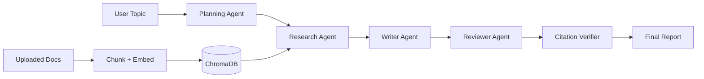

# System Architecture

## Multi-Agent Workflow

## RAG Pipeline

1. User uploads PDF, DOCX, or TXT.
2. Text is extracted with `pdf-parse`, `mammoth`, or native text loading.
3. `RecursiveCharacterTextSplitter` creates 1000-character chunks with 200-character overlap.
4. Deterministic embeddings are stored in ChromaDB, with an in-memory fallback when Chroma is unavailable.
5. The Research Agent queries by topic and outline sections, then passes context to downstream agents.

## Data Models

- User - authentication, role, activity, and report count.
- Document - file metadata, chunk count, Chroma IDs, processing status.
- Report - outline, sections, references, metrics, and agent statistics.
- AgentLog - LLMOps prompt logs, masked prompts, responses, tokens, latency, model, and failures.
- AuditLog - protected security and user activity events.
- Feedback - user ratings and comments.

## Security Layers

| Layer | Implementation |
| --- | --- |
| Transport | Helmet, CORS whitelist |
| Auth | JWT bearer tokens |
| RBAC | `authorize('admin')` middleware |
| Input | `express-validator`, sanitization |
| Prompt security | Prompt injection detection |
| Files | MIME and extension whitelist, size limits |
| Rate limit | `express-rate-limit` on `/api` |
| Audit | Per-action audit middleware |

## AI Evaluation

Metrics are computed after generation from sections, references, and retrieval scores:

- Relevance score.
- Faithfulness score.
- Hallucination risk.
- Citation coverage percentage.
- Retrieval accuracy.
- Response quality.
- User feedback rating.
